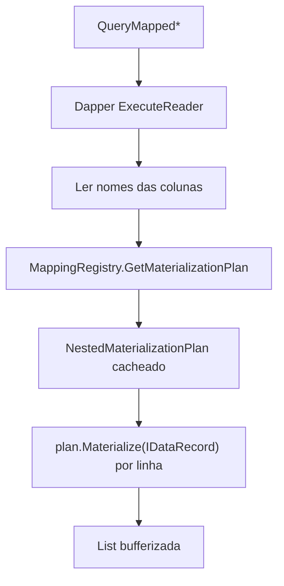
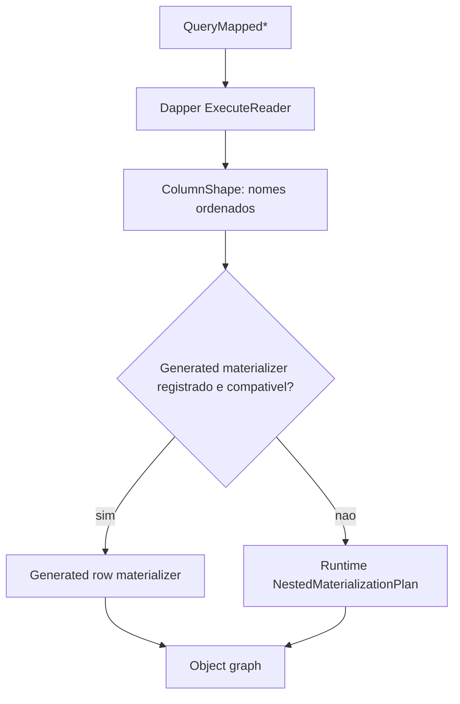
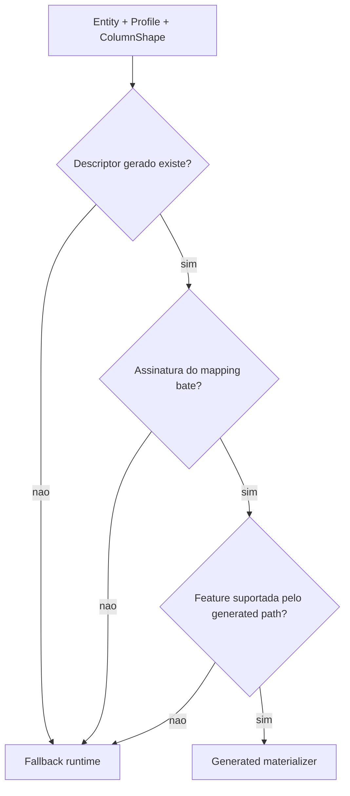

# Arquitetura de Materializacao Gerada

Status: SPECIFICATION
Prompt: 7.1
Data: 2026-07-27

## Problema

`QueryMapped*` e hoje o caminho opt-in do FluentMap para materializacao avancada. Ele permite que a biblioteca controle a transformacao:

```text
IDataReader / IDataRecord -> metadata de mapping -> object graph
```

Esse caminho suporta objetos aninhados, Value Objects imutaveis, constructor mapping e mapping profiles, mas depende de metadata em runtime, reflection e `Expression.Compile` para montar o plano de materializacao. Isso aparece principalmente em:

- `src/Dapper.FluentMap/QueryMappedExtensions.cs`;
- `src/Dapper.FluentMap/MappingRegistry.cs`;
- `src/Dapper.FluentMap/Materialization/NestedMaterializationPlan.cs`;
- `src/Dapper.FluentMap/Compatibility/DapperTypeHandlerAdapter.cs`.

O custo e o risco atual estao concentrados em:

- criacao de `DefaultTypeMap`, acesso a `PropertyInfo`, `FieldInfo`, `ConstructorInfo` e `ParameterInfo`;
- factories, getters, setters, conversores e chamadas de construtor compilados com expression trees;
- `Activator.CreateInstance` para defaults de value types e criacao de maps por assembly scanning;
- integracao delicada com TypeHandlers do Dapper via `SqlMapper.TypeHandlerCache<T>.Parse(object)`;
- cache de planos por tipo, profile e shape ordenado de colunas;
- annotations publicas `RequiresUnreferencedCode` e `RequiresDynamicCode` nos helpers `QueryMapped*`.

O objetivo da Etapa 7 e especificar uma evolucao incremental para substituir parte desse caminho por codigo gerado quando a configuracao for estaticamente conhecida, sem remover o materializador runtime.

## Objetivos

- Definir uma arquitetura para materializadores gerados por source generator.
- Preservar o foco do FluentMap em mapping metadata e materializacao de object graph, nao em ORM.
- Permitir que `QueryMapped*` use codigo gerado para casos elegiveis.
- Manter fallback runtime para configuracoes dinamicas, assembly scanning, conventions customizadas e shapes nao gerados.
- Reduzir dependencias de reflection e dynamic code no caminho gerado.
- Criar uma base para validacao futura de performance, trimming e Native AOT.
- Preservar compatibilidade publica e comportamento observavel existente.

## Nao Objetivos

- Nao recriar Dapper.AOT.
- Nao substituir `Dapper.Query<T>()` nem o type map normal instalado por `SqlMapper.SetTypeMap`.
- Nao adicionar ORM, CRUD, SQL generator, LINQ provider, migrations, Unit of Work ou change tracking.
- Nao tornar o source generator obrigatorio para consumidores atuais.
- Nao remover `QueryMapped*` runtime.
- Nao declarar suporte Native AOT completo antes de publish/run real.
- Nao gerar materializers para DSL dinamica, construtores de maps arbitrarios ou conventions customizadas nesta especificacao.
- Nao alterar comportamento publico nesta fase.

## Arquitetura Atual

### Caminho Dapper normal

`FluentMapper.Initialize(...)` registra maps e conventions no `MappingRegistry`. Para maps default e conventions por entidade, o registry instala um `FluentMapTypeMap` no Dapper:

```text
FluentMapTypeMap
  -> FluentConstructorTypeMap
  -> DapperFluentPropertyTypeMap
  -> DefaultTypeMap
```

Esse caminho continua sendo o padrao para:

```csharp
connection.Query<Customer>(sql);
connection.QuerySingle<Customer>(sql);
```

Ele cobre mapeamentos root-level e constructor mapping simples, mas nao materializa object graphs aninhados.

### Caminho QueryMapped runtime

`QueryMappedExtensions` executa o comando usando Dapper (`SqlMapper.ExecuteReader` / `ExecuteReaderAsync`), coleta os nomes de colunas do `IDataReader`, pede ao `MappingRegistry` um `NestedMaterializationPlan` e materializa todas as linhas em uma lista bufferizada.



O cache atual usa:

```text
EntityType + ProfileType + ordered column names
```

O `NestedMaterializationPlan`:

- resolve o mapping efetivo por coluna;
- usa profile quando `QueryMapped<TEntity, TProfile>()` e chamado;
- preserva `MemberPath` completo, nao apenas o nome terminal;
- aplica explicit mapping e depois fallback `DefaultTypeMap` para colunas nao mapeadas;
- constroi subarvores por semantica de `DBNull`;
- escolhe construtores publicos compativeis para objetos imutaveis e Value Objects;
- compila factories, getters, setters e construtores com `Expression.Compile`;
- usa `DapperTypeHandlerAdapter` quando ha TypeHandler Dapper para o tipo alvo.

### Source generator atual

`Dapper.FluentMap.Generators` gera apenas registro de mappings:

```csharp
// API existente emitida pelo generator atual.
configuration.AddGeneratedMappings();
```

Ele descobre maps elegiveis na compilacao atual e emite chamadas a `AddMap<TMap>()` ou `AddProfile<TMap>()`. Ele nao interpreta completamente o corpo dos maps, nao gera materializers e nao substitui `FluentMapper.Validate()`.

### Analyzers atuais

`Dapper.FluentMap.Analyzers` valida parte da DSL em compile-time:

- expressoes `Map(...)` que precisam virar property path;
- duplicidade de member path;
- duplicidade de coluna literal;
- `IncludeBase<TBase>()` invalido;
- `AddMap<TMap>()` e `AddProfile<TMap>()` genericos invalidos;
- duplicidade de profile registrado em um metodo de configuracao.

Essa capacidade mostra que ha um subconjunto da DSL que pode ser reconhecido estaticamente, mas ela nao executa construtores de maps.

## Custos e Dependencias Substituiveis Futuramente

| Area atual | Local principal | Custo/dependencia | Substituivel por geracao? |
| --- | --- | --- | --- |
| Shape de colunas | `QueryMappedExtensions.GetColumnNames` | leitura runtime necessaria por query | Parcial. O shape real sempre vem do reader. |
| Lookup de plano | `MappingRegistry.GetMaterializationPlan` | cache por tipo/profile/colunas | Sim, com registry de materializers gerados antes do fallback. |
| Resolucao de member path | `NestedMaterializationPlan.Create` | `PropertyInfo`, `DefaultTypeMap` | Sim para maps estaticos; fallback para default Dapper/conventions dinamicas. |
| Getters/setters | `CreateGetter`, `CreatePropertySetter`, `CreateFieldSetter` | `Expression.Compile` | Sim, chamadas diretas no codigo gerado. |
| Construtores | `CreateConstructorFactory`, `SelectConstructor` | reflection + delegate compilado | Sim para construtores publicos conhecidos via symbols. |
| Conversao escalar | `CreateConverter`, `ConvertValue` | delegates e reflection para enum/Guid/default | Parcial; regras comuns geraveis, TypeHandler exige decisao propria. |
| TypeHandler Dapper | `DapperTypeHandlerAdapter` | reflection em tipo nested do Dapper + `Expression.Compile` | Em aberto. Precisa boundary estavel. |
| Defaults de value type | `Activator.CreateInstance` | reflection-ish runtime | Sim em codigo generico/typed ou `default(T)`. |
| Assembly scanning | `FluentMapConfiguration.AddMapsFromAssembly` | RUC e reflection discovery | Nao para scanning em si; fallback permanece. |

## Arquitetura Proposta

A arquitetura proposta adiciona uma camada de materializers gerados antes do `NestedMaterializationPlan`. Essa camada e proposta futura, nao existe no codigo atual.



### Conceito proposto: materializer gerado

Proposta futura de contrato conceitual:

```csharp
// Proposta futura. Nao existe hoje.
internal delegate object GeneratedRowMaterializer(IDataRecord record);
```

O materializer gerado deve receber somente um `IDataRecord` ou `IDataReader` ja posicionado na linha atual e devolver uma entidade materializada. Ele nao deve:

- abrir conexao;
- executar SQL;
- criar commands;
- interpretar parametros;
- fazer tracking;
- gerar SQL;
- depender de APIs internas instaveis do Dapper.

### Conceito proposto: descriptor gerado

Proposta futura:

```csharp
// Proposta futura. Nao existe hoje.
internal sealed class GeneratedMaterializerDescriptor
{
    // EntityType
    // ProfileType opcional
    // ColumnShape esperado
    // assinatura/hash do mapping estatico usado na geracao
    // delegate de materializacao por linha
}
```

O descriptor precisa carregar informacao suficiente para responder:

- a entidade e o profile batem?
- o shape ordenado de colunas bate?
- a configuracao efetiva ainda corresponde ao mapping usado na geracao?
- o materializer pode ser usado sem fallback?

O shape deve continuar considerando a ordem das colunas, porque o codigo gerado pode usar ordinais fixos.

## Fronteira Entre Dapper e FluentMap

Dapper continua responsavel por:

- executar comandos;
- gerenciar parametros;
- abrir `IDataReader` por `SqlMapper.ExecuteReader`;
- manter o comportamento de `Query<T>()` e `QuerySingle<T>()`;
- aplicar TypeHandlers em seus caminhos normais;
- fornecer o type map publico usado no caminho root-level.

FluentMap deve ser responsavel por:

- resolver metadata efetiva de mapping;
- escolher entre materializer gerado e fallback runtime;
- materializar object graphs quando o usuario opta por `QueryMapped*`;
- preservar profiles query-scoped;
- diagnosticar por que um shape usa generated ou fallback.

O source generator nao deve chamar APIs internas do Dapper nem gerar um pipeline de consulta. O alvo e apenas:

```text
IDataRecord -> entidade
```

## Responsabilidades do Runtime

Na arquitetura proposta, o runtime do core deve:

- manter as APIs publicas existentes;
- continuar executando `QueryMapped*` via Dapper para obter o reader;
- construir a chave `EntityType + ProfileType + ColumnShape`;
- procurar descriptor gerado antes de montar um `NestedMaterializationPlan`;
- validar que o descriptor gerado corresponde ao mapping efetivo registrado;
- usar fallback runtime quando nao houver match seguro;
- manter invalidacao de caches quando mapas/conventions sao alterados via APIs de registro;
- preservar as annotations RUC/RDC enquanto qualquer chamada puder cair no fallback runtime;
- expor diagnostics futuros sem prometer uso de generated quando nao for garantido.

## Responsabilidades do Source Generator

O generator futuro deve:

- continuar emitindo `AddGeneratedMappings()` de forma compativel;
- descobrir somente maps na compilacao atual;
- interpretar apenas um subconjunto estatico da DSL;
- nunca executar construtores de maps;
- gerar descriptors/materializers para maps com metadata estaticamente conhecida;
- emitir diagnostics informativos para maps nao geraveis, sem quebrar fallback;
- representar profiles por `TProfile`;
- preservar ordem de registro compatibilizada com `IncludeBase<TBase>()`;
- gerar codigo direto para construtores publicos, setters publicos e paths conhecidos;
- evitar dependencia em reflection ou dynamic code no hot path gerado.

Subconjunto inicial recomendado:

- `Map(x => x.Property)` e `Map(x => x.Nested.Property)`;
- `ToColumn("literal")`;
- `Ignore()`;
- `IncludeBase<TBase>()` quando base map tambem for geravel;
- `IProfileMap<TProfile>`;
- construtores publicos cujo binding por nome/tipo seja estaticamente determinavel.

Fora do subconjunto inicial:

- nomes de coluna calculados;
- helper methods arbitrarios dentro do map;
- maps com estado de instancia externo;
- assembly scanning;
- conventions customizadas;
- `NamingPolicy.Custom`;
- TypeHandlers sem boundary definida;
- factory methods de Value Objects.

## Contrato Esperado do Materializer Gerado

O materializer gerado deve preservar estes contratos comportamentais do runtime atual:

- explicit mappings tem precedencia sobre fallback;
- profile e selecionado por operacao `QueryMapped<TEntity, TProfile>()`;
- profile nao altera `SqlMapper.SetTypeMap` global;
- `MemberPath` completo identifica o mapping;
- paths como `Rank.Level` e `Seniority.Level` nao colidem;
- colunas ignoradas nao sao materializadas;
- colunas nao cobertas pelo FluentMap podem continuar usando fallback quando seguro;
- exceptions de dominio durante constructor materialization devem ser encapsuladas com contexto de mapping;
- comportamento publico de `Single()`, buffering e exceptions LINQ dos helpers atuais deve permanecer.

Como proposta futura, um materializer gerado deve ser tratado como uma otimizacao de execucao, nao como um novo contrato funcional para o usuario.

## Estrategia de Fallback

Fallback e obrigatorio.

Regras propostas:

- se nao houver descriptor gerado para entity/profile/shape, usar `NestedMaterializationPlan`;
- se o descriptor existir mas a configuracao efetiva nao corresponder, usar fallback;
- se qualquer parte do mapping exigir convention dinamica, scanning ou metadata nao gerada, usar fallback;
- se o generator encontrar uma configuracao parcialmente geravel, gerar diagnostics informativos e deixar o runtime cobrir;
- se o fallback for usado, manter exatamente as mesmas validations e exceptions atuais.



## Comportamento Sem Codigo Gerado

Quando o consumidor nao referencia o pacote generator, quando um map nao e elegivel ou quando a query tem shape nao gerado:

- `QueryMapped*` continua funcionando como hoje;
- as annotations RUC/RDC continuam corretas;
- nenhuma configuracao existente passa a exigir generator;
- `FluentMapper.Initialize`, `Validate`, `Explain`, `GetEntityMaps` e `GetTypeConventions` continuam funcionando;
- Dapper default mapping continua sendo fallback para `Query<T>()`.

## Profiles

Profiles sao bons candidatos para geracao porque ja possuem identidade fortemente tipada:

```text
EntityType + ProfileType + ColumnShape
```

Requisitos:

- default map e profile map devem ter descriptors separados;
- `QueryMapped<TEntity>()` deve usar o default;
- `QueryMapped<TEntity, TProfile>()` deve procurar materializer do profile;
- ausencia de profile registrado deve continuar gerando `FluentMapConfigurationException`;
- profiles gerados nao podem vazar para o type map global do Dapper;
- inherited profile maps devem respeitar a ordem e a validacao ja existentes.

## Nested Objects

Para objetos aninhados mutaveis, codigo gerado pode emitir chamadas diretas equivalentes a:

```text
if any column in subtree is non-null:
    create/reuse nested object when supported
    assign leaves
else:
    assign null to subtree when assignable
```

Requisitos:

- manter semantica atual de subarvore toda `NULL`;
- preservar uso de objeto intermediario existente quando a regra atual usa getter + setter;
- rejeitar paths sem construtor/setter publico quando nao houver constructor binding compativel;
- nao declarar suporte a objetos intermediarios privados ou factories sem nova API explicita.

## Immutable Objects

Objetos imutaveis devem ser construidos bottom-up quando o construtor publico puder ser selecionado por parametros compativeis.

Requisitos:

- selecionar construtor por nome de parametro e compatibilidade de tipo, espelhando a regra runtime;
- tratar ambiguidade como erro deterministico;
- exigir que propriedades sem setter estejam ligadas a construtor;
- encapsular falhas do construtor com contexto de tipo, member path e colunas;
- manter fallback para casos que dependam de runtime metadata.

## Value Objects

Value Objects mapeados por componentes devem seguir a mesma estrategia de imutaveis:

```text
component columns -> Value Object constructor -> property/root constructor
```

Requisitos:

- subarvore toda `NULL` vira `null` quando o destino aceita null;
- subarvore parcialmente preenchida cria o Value Object;
- factory methods continuam fora do contrato atual;
- TypeHandler segue sendo recomendado para Value Object escalar mapeado como propriedade inteira.

## Null Semantics

O caminho gerado deve preservar:

- `DBNull` em reference type ou nullable vira `null`;
- `DBNull` em value type nao anulavel segue o default usado pelo runtime atual;
- subarvore aninhada toda `NULL` nao cria objeto;
- subarvore parcialmente preenchida cria objeto e converte cada folha;
- constructor args devem receber `null`/default conforme o tipo alvo.

## Diagnostics

Diagnostics futuros devem ser claros, mas nao devem transformar fallback em erro.

Possiveis pontos de diagnostico:

- map elegivel para materializer gerado;
- map nao geravel e motivo;
- query shape sem descriptor;
- descriptor encontrado mas invalido pela configuracao efetiva;
- `Explain` futuro indicando materializacao `Generated` vs `Runtime` como proposta.

Importante: nao documentar `Generated` como valor existente de `MappingMaterialization`; hoje os valores reais cobrem Dapper, Nested e ValueObject.

## Trimming

O generated path deve evitar:

- assembly scanning;
- `Activator.CreateInstance` para materializacao;
- `Expression.Compile`;
- reflection para acessar members no hot path.

Ainda assim:

- APIs que podem cair no fallback devem continuar anotadas;
- explicit/generated registration continua sendo o caminho preferencial em trimmed apps;
- materializers gerados para maps estaticos podem reduzir warnings em cenarios futuros, mas isso precisa de smoke dedicado.

## Native AOT

O generated path deve ser projetado para Native AOT, mas a compatibilidade so pode ser declarada depois de validacao real.

Requisitos para etapas futuras:

- publish AOT em ambiente com toolchain nativa disponivel;
- executar queries reais com SQLite ou provider compatvel;
- comparar generated path e fallback;
- revisar warnings do FluentMap e warnings herdados do Dapper;
- manter fallback anotado enquanto existir possibilidade de dynamic code.

## Backward Compatibility

A evolucao pode ser compativel se:

- nenhuma API atual for removida;
- `QueryMapped*` continuar funcionando sem generator;
- `AddGeneratedMappings()` continuar registrando maps como hoje;
- maps dinamicos continuarem suportados pelo fallback;
- `FluentMapper.EntityMaps` e `TypeConventions` continuarem existindo;
- `Dapper.Query<T>()` nao mudar;
- Dommel nao for envolvido automaticamente.

Qualquer API publica nova para registro de materializers gerados deve ser pequena, aditiva e versionada com cuidado.

## Extensibilidade Futura

Areas possiveis, fora da primeira implementacao:

- manifests por assembly para materializers de dependencias;
- diagnostico publico de cobertura generated/fallback;
- API explicita para factory methods de Value Objects;
- boundary publica para conversao via TypeHandler sem reflection interna do Dapper;
- generated support para naming policies built-in registradas estaticamente;
- streaming/unbuffered baseado em materializer por linha.

## Riscos

- O generator interpretar demais a DSL e gerar codigo incorreto.
- Fallback pouco visivel gerar expectativa errada de performance/AOT.
- Public mutable dictionaries invalidarem descriptors gerados.
- TypeHandlers exigirem acoplamento maior ao Dapper.
- Conventions customizadas limitarem a cobertura gerada.
- Codigo gerado duplicar regras do runtime e divergir com o tempo.
- Ganhos de performance permanecerem hipotese sem benchmark.
- Native AOT ser bloqueado por dependencias fora do FluentMap.

## Decisoes Ainda em Aberto

- Qual sera a menor API/runtime boundary para registrar descriptors gerados?
- O descriptor deve ser publico, internal com `InternalsVisibleTo`, ou emitido no namespace do core?
- Como validar assinatura de mapping efetivo sem depender de strings frageis?
- Como representar fallback diagnostics sem poluir a API publica?
- Como integrar TypeHandlers Dapper sem depender de detalhes internos?
- Naming policies built-in entram na primeira fase gerada ou ficam para depois?
- Havera suporte a manifests de assemblies referenciados?
- Em que momento as annotations RUC/RDC poderiam ser relaxadas, se algum dia puderem?

## Plano Incremental da Etapa 7

1. Benchmarks
   - Criar baseline comparando Dapper default, `QueryMapped*` runtime e PoC/generated-like.
   - Medir first query, throughput por linha, alocacao e custo de cache.
2. Contratos runtime
   - Definir chave, descriptor, lookup, validacao de correspondencia e fallback.
   - Manter API publica aditiva e pequena.
3. Flat/simple materialization
   - Gerar materializers para propriedades root simples com `ToColumn("literal")`.
   - Cobrir default profile e profiles explicitos.
4. Nested/value object materialization
   - Gerar nested mutable objects, imutaveis e Value Objects por construtores publicos.
   - Preservar null semantics e exceptions com contexto.
5. Runtime integration
   - Integrar lookup generated antes do `NestedMaterializationPlan`.
   - Adicionar diagnostics de generated/fallback.
6. AOT/performance validation
   - Executar trimmed smoke, Native AOT smoke e benchmarks formais.
   - So entao documentar ganhos ou reducao de warnings.

## Arquivos Relevantes

- `README.md`
- `Dapper.FluentMap.sln`
- `src/Dapper.FluentMap/QueryMappedExtensions.cs`
- `src/Dapper.FluentMap/MappingRegistry.cs`
- `src/Dapper.FluentMap/Materialization/NestedMaterializationPlan.cs`
- `src/Dapper.FluentMap/Materialization/MaterializationPlanCacheKey.cs`
- `src/Dapper.FluentMap/Mapping/MemberPath.cs`
- `src/Dapper.FluentMap/Mapping/EntityMap.cs`
- `src/Dapper.FluentMap/Compatibility/DapperTypeHandlerAdapter.cs`
- `src/Dapper.FluentMap.Generators/MappingRegistrationGenerator.cs`
- `src/Dapper.FluentMap.Analyzers/FluentMapConfigurationAnalyzer.cs`
- `test/Dapper.FluentMap.Tests/GeneratedMaterializerSpikeTests.cs`
- `test/Dapper.FluentMap.GeneratedRegistration.Tests/GeneratedRegistrationIntegrationTests.cs`
- `test/Dapper.FluentMap.AotSmoke/Program.cs`
- `docs/sdd/etapa-6/04-generated-materializer-spike.md`
